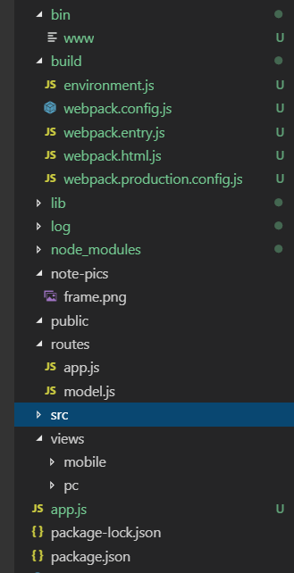
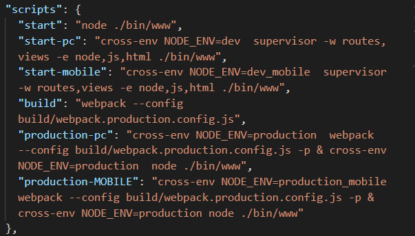

##### 项目初衷
- 这个项目主要是对公司原来的官网进行重构。
官网构成很简单，几个展示页面，共用footer，header，手机端和电脑端采用了两套页面，旧版官网是前后端不分离的，使用jsp来构建页面，通过java中的action文件来判断手机还是电脑访问，以及传递数据到jsp进行渲染。
- 对于官网来说，使用jsp渲染有利于SEO,服务端渲染速度也会相对快一些。但是对于前端来说，在构建官网的时候，除了要写基本的前端代码，还要写一些jsp代码，还要在java的action里面写一些java代码，旧版官网在后端小伙伴的帮助下勉强完成了。考虑到后期招新人官网越来越难以维护，以及对express神往已久，以及用不惯idea及eclipse，所以趁着工作不太忙进行了这次项目重构。
- 结合node，同样实现了在服务端渲染页面，而且某种意义上也算是实现了前后端分离，前端通过node调用后端提供的api，项目更容易维护了。

##### 项目结构


- bin文件夹参考了express-generator 用来启动http服务
- app.js 用来配置模板引擎，日志打印，开发模式下热更新，引入路由等
- routes中的app.js 配置路由（由于页面不太多且只有几页需要获取接口，所以把路由放在一个文件了，也可以每页一个路由文件）渲染页面，model.js调取后台接口，生成渲染数据
- src存放前端css，js，图片等
- views存放渲染html
- public存放webpack编译之后的静态文件

##### 使用supervisor监测文件修改自动重启

```
-w 后面是要监控的文件夹或js文件,
-e 后面是要监控的文件扩展名默认是node，js
```
为了使项目结构更加清晰，我把pc的资源和mobile的资源分别放置在了不同的文件夹中，pc和mobile下同一页面我采用了同一命名，为了便于在webpack进行编译时读取入口文件和打包到对应的文件夹，我在package.json的scripts里面分别对pc和mobile下的资源进行开发过程中的start和和开发结束后的production。production是将文件进行webpack发布模式下的编译，编译之后文件会打包到public文件夹中，我这种方式，需要在发布代码之前，分别执行npm run production-pc和production-mobile命令，进行两次编译。

##### 开发模式下的webpack无刷新更新
使用webpack-dev-middleware和webpack-hot-middleware实现浏览器的无刷新更新。
- webpack-dev-middleware (https://github.com/webpack/webpack-dev-middleware)  
  webpack-dev-middleware输出的文件存于**内存**中，定义了webpack.config.js，webpack就能根据配置项构建出entry和ouput模块的关系，webpack-dev-middleware在此基础上形成一个文件映射系统，每当应用程序请求一个文件，它匹配到了就把内存中缓存的对应的结果以文件的格式返回给你，反之就进入下一个中间件。
- webpack-hot-middleware(https://www.npmjs.com/package/webpack-hot-middleware)  
 webpack-hot-middleware 
 webpack-hot-middleware结合webpack-dev-middleware可以实现浏览器的无刷新更新    
 需要同时在entry里引入"webpack-hot-middleware/client"  （webpack.entry.js）
 ```
    var hotMiddlewareScript = 'webpack-hot-middleware/client';
    entry[file] = [filePath + '/'+file+'/app.js',hotMiddlewareScript];
 ```

 参考代码如下：(根目录app.js)
 ```
 if (isDev) {
  var webpack = require('webpack'),
      webpackDevMiddleware = require('webpack-dev-middleware'),
      webpackHotMiddleware = require('webpack-hot-middleware'),
      webpackDevConfig = require('./build/webpack.config');
  var compiler = webpack(webpackDevConfig);
  app.use(webpackDevMiddleware(compiler, {
    publicPath: webpackDevConfig.output.publicPath,
    noInfo: true,
    // 这里强制将html文件写入（需要为编译后的html文件设置模板引擎）
    writeToDisk: (filename) => {
      return /\.html$/.test(filename)
    },
    stats: {
      colors: true
    }
  }))
 
  app.use(webpackHotMiddleware(compiler));
  require('./routes/app')(app);
} 
 ```

- 在发布模式，只需要使用express.static来使用相应的静态资源(根目录app.js)  
```
    app.use(express.static(path.join(__dirname, 'public/pc')));
    app.use(express.static(path.join(__dirname, 'public/mobile')));
    // 引用相应的路由文件
    require('./routes/app')(app);
```

##### 路由及模板引擎的设置
- 在项目中通过node调取后端服务，为了方便我采用了axios (routes/model.js)
```
model.getPositions = function(callback) {
    return axios.get(model.baseUrl + 'rest/position/page', {
        params: {
           
        }
    }).then(response => {
        if(response.data.code === 200){
           // ...
        }
        callback && callback();
    }).catch(e => {
        callback && callback();
    });
}
```
- 在(router/app.js)里面配置路由，根据访问设备，分别跳转到手机端和pc端网页,并且在渲染view的时候将服务器数据传递到view
```
router.get('/', function (req, res, next) {
    model.getNewsList();
    next();
}, function(req, res, next) {
    if (isMobile(req)) {
        res.render(mobileViewPath + '/index', { baseMsg: model.baseMsg, allNews: model.allNews});
    } else {
        res.render(viewPath + '/index', { baseMsg: model.baseMsg, rollNewsList: model.rollNewsList });
    }
});
```
- 在view中使用ejs来渲染数据,这就需要我们给view设置模板引擎。这里有个问题就是我们的项目中的views文件夹是开发过程中的，最终要将它们通过webpack打包到public文件夹中，这样的话，最终部署的时候我们不再需要views文件夹只上传public文件夹就可以了，所以最终node端用模板引擎渲染的是public中打包后的文件。即需要把public文件夹中的html设置为ejs模板引擎。  
(app.js)
```
// view engine setup
app.engine('html', ejs.__express);
app.set('views', path.resolve(__dirname, 'public/pc/views'));
app.set('views', path.resolve(__dirname, 'public/mobile/views'));
app.set('view engine', 'html');
```
**这里有一个问题就是使用"html-webpack-plugin",在template选项中默认template使用ejs模板引擎，这样的话在views文件夹中写ejs模板引擎会直接被渲染，并且我们设置的路由渲染页面是public中的html，所以在views中会拿不到服务端传递数据而报错，我这里修改了template的模板引擎为handlebars，这样的话在webpack编译的时候就会默认忽略掉ejs代码，在public中保留了ejs代码**
```
       let opts = {
        inject: 'body',
        filename: 'views/'+file + '.html',
        template:'handlebars-loader!'+(templatePath + file + '.html'),
        chunksSortMode: 'manual',
        chunks: [file],
        hash: true,
    }
```

webpack的配置这里就不说了，都是一些常规的配置。

##### 使用pm2及nginx进行部署
- 在服务器上安装node,安装pm2
- 将项目中的（routes public bin app.js packge.json(删除掉了devDependencies)，bin）拷贝到服务器相应目录，在项目根目录安装依赖，并且在该目录下启动pm2（pm2 start ./bin/www）,这样就可以通过服务器ip加相应端口号访问项目了  
pm2常用命令
  ```
    pm2 start ./bin/www    # 启动node服务
    pm2 start ./bin/www --name home-satrt # 命名进程
    pm2 list               # 显示所有进程状态
    pm2 monit              # 监视所有进程
    pm2 logs               # 显示所有进程日志
    pm2 stop all           # 停止所有进程 
    pm2 restart all        # 重启所有进程
    pm2 reload all         # 0 秒停机重载进程 (用于 NETWORKED 进程)   
    pm2 stop 0             # 停止指定的进程
    pm2 restart 0          # 重启指定的进程
    pm2 startup            # 产生 init 脚本 保持进程活着 [pm2 startup systemd （开机自启） ]
    pm2 web                # 运行健壮的 computer API endpoint (http://localhost:9615)
    pm2 delete 0           # 杀死指定的进程
    pm2 delete all         # 杀死全部进程
  ```
- 配置nginx，如果服务器没有装nginx需要先进行安装    
  常用命令
  ```
    nginx -t        #检测nginx配置文件是否正确
    nginx           #nginx启动
    nginx -s stop   #nginx关闭
    nginx -s reload #nginx平滑重启
  ```
- 修改nginx配置文件
 ```
    upstream test {
        server 127.0.0.1:3000;
        keepalive 64;
    }
    server {
        listen 80;
        server_name aaa.XXX.com
        root /data/www/home/dwt-gw;
        location / {
          # Proxy_pass configuration 
          proxy_set_header X-Forwarded-For $proxy_add_x_forwarded_for; 
          proxy_set_header Host $http_host; 
          proxy_set_header X-NginX-Proxy true; 
          proxy_http_version 1.1; 
          proxy_set_header Upgrade $http_upgrade; 
          proxy_set_header Connection "upgrade"; 
          proxy_max_temp_file_size 0; 
          proxy_pass http://test/; 
          proxy_redirect off; 
          proxy_read_timeout 240s; 

        }
    }
 ```
 然后启动nginx，根据所配置的server_name就可以访问相应项目了